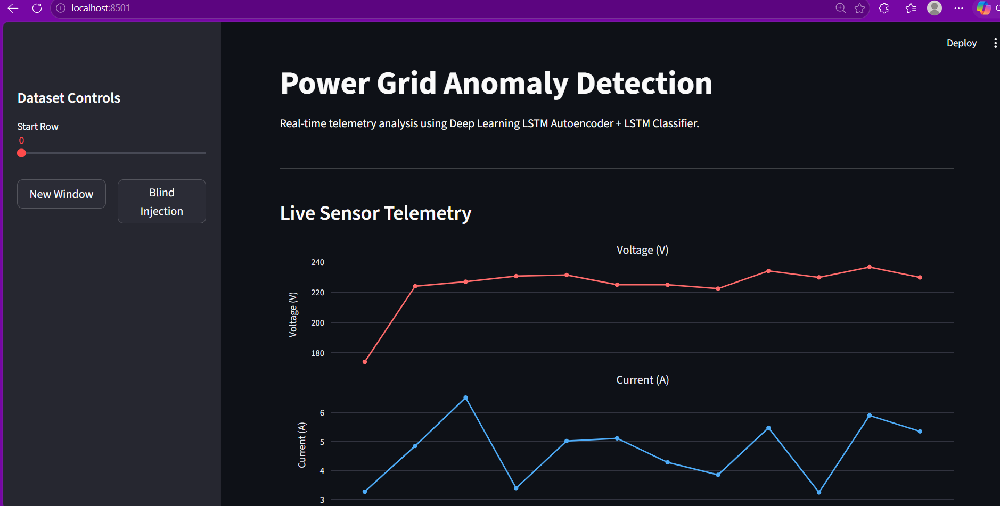
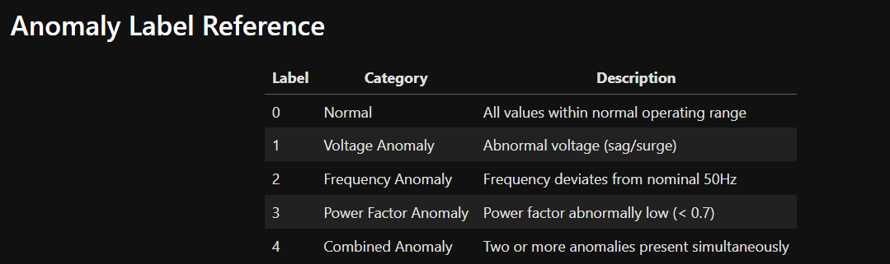
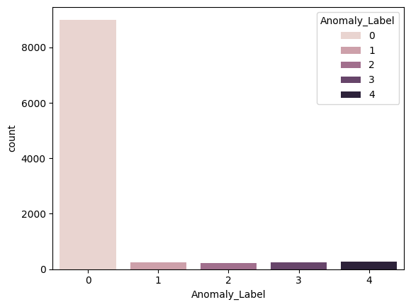
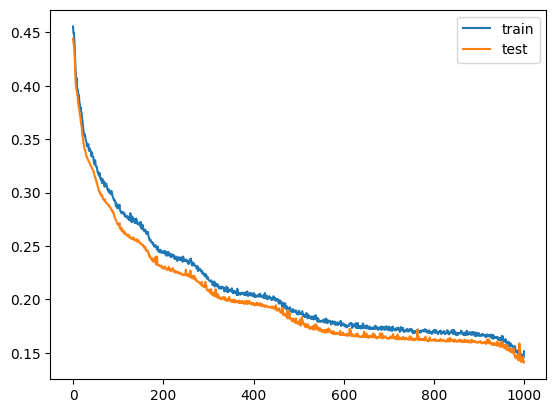
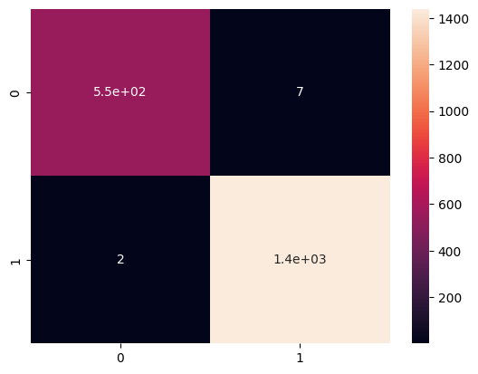
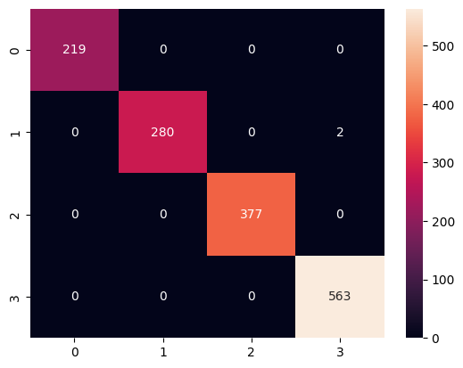

# Power Grid Anomaly Detection

Deep learning-based power grid anomaly detection using sequence modeling, reconstruction error analysis, and classification for grid event monitoring.

## Overview

This project presents a deep learning pipeline for detecting anomalies in power grid data using sequence-based modeling. It combines an LSTM autoencoder for anomaly-sensitive feature learning with a downstream classifier for fault category prediction, and also includes a Streamlit interface for interactive analysis and visualization.

## Key Features

- LSTM-based sequence modeling for power grid anomaly detection.
- Autoencoder-driven latent feature learning from multivariate grid signals.
- Multi-class classification of grid conditions including normal and anomalous states.
- Streamlit application for interactive fault analysis and visualization.
- Modular project structure with saved model weights and deployment files.

## Dataset and Classes

The project works on multivariate power system measurements and frames anomaly detection as a multi-class learning problem.

The notebook defines the following operating classes:

- Normal
- Voltage Anomaly
- Frequency Anomaly
- Power Factor Anomaly
- Combined Anomaly

## Methodology

The workflow begins with preprocessing and organizing the power grid signals into sequence windows suitable for recurrent modeling.

An LSTM autoencoder is used to learn sequence representations, after which learned features are used for downstream classification of grid conditions.

This design allows the project to combine temporal pattern learning with anomaly-oriented decision support.

## Model Training

The notebook includes model training and evaluation for the sequence-learning stage.

## Evaluation

Because this project involves classification across multiple grid conditions, confusion matrices are among the most informative result visuals for the README.

## Repository Structure

- `1.Power Grid Anomaly Detection (LSTM Autoencoder + Streamlit).ipynb` — main notebook for preprocessing, training, and evaluation.
- `grid_anomaly/` — deployment-oriented project files including app and model components.
- `requirements.txt` — dependency file for reproducibility.

## Applications

This project is relevant to:

- smart grid monitoring,
- anomaly-aware grid diagnostics,
- fault classification in electrical systems,
- AI-assisted condition monitoring for power networks.

## Future Improvements

- Add stronger repository cleanup and dependency specification for easier reproduction.
- Extend benchmarking with additional anomaly detection baselines.
- Improve deployment packaging for smoother end-user execution.

## Author

Abhishek Pawar
